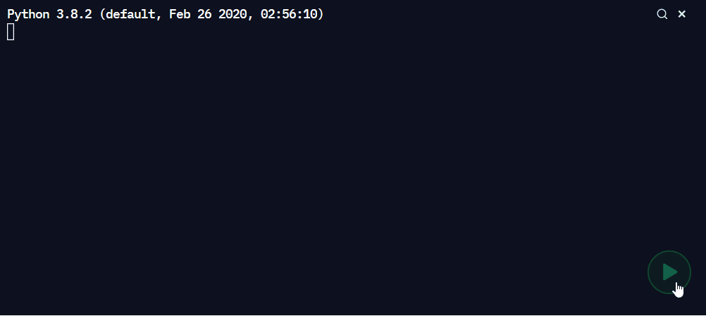

<h1 align="center"> Phazed Game and Player </h1>

> play a game of Phazed with a bot or with other players or watch bots play with each other

## [Live Demo](https://replit.com/@unixc/cli-phazed?embed=1&output=1#.replit)
> hosted on repl.it



## Technologies Used
* Python
* Python Standard Libraries:
  * collections (defaultdict)
  * itertools
  * random

## About Phazed, the game
* A card game based off games like [Phase 10](https://en.wikipedia.org/wiki/Phase_10) and [Rummy](https://en.wikipedia.org/wiki/Rummy)
* Details about the game and how to play it can be found in [`gamespec.pdf`](gamespec.pdf)

## Installation
> if you do not intend on ammending the code or adding additional players, you might want to use the [Live Demo](#live-demo) instead

1. Make sure Python is installed on your system: [Download Python]( https://www.python.org/downloads/)
2. Clone the repository or Download ZIP
    ```shell
    git clone https://github.com/Qwek-alt/cli-phazed.git
    ```
3. Run `game.py` to play the game
    ```shell
    python game.py
    ```

## Playing the Game with `game.py`
* Default Settings
  * Normal Game
  * 4 players
    * 1 Human player and 3 Bot players
  * Automatic Card Handling
* Custom Settings
  > can be changed by entering `No` when asked ` → Use default settings? [Yes/No]:`
  * Normal/Bonus game (to be added)
  * Number of Players (2 to 4 players)
    * consisting of either Human of Bot players
  * Automatic Card Handling
* Inputs
  * generally not case sensative (except for Bot names)
  * `[Yes/No]` questions can be replied with `y` or `n`

## How to Add A Bot
1. Create `bot1.py` in same folder as where `game.py` is located
2. Uncomment the following lines (marked with ☚)
    ```python
    # Import Bots
    from bot0 import phazed_play as bot0
    # from bot1 import phazed_play as bot1  ☚
    # from bot2 import phazed_play as bot2
    # from bot3 import phazed_play as bot3

    # Import Bonus Bots
    from bonusbot0 import phazed_bonus as bonusbot0
    # from bonusbot1 import phazed_bonus as bonusbot1  ☚
    # from bonusbot2 import phazed_bonus as bonusbot2
    # from bonusbot3 import phazed_bonus as bonusbot3

    BOTS = {
        "Bot0": bot0,
        # "Bot1": bot1,  ☚
        # "Bot2": bot2,
        # "Bot3": bot3,
        "BonusBot0": bonusbot0 #,
        # "BonusBot1": bonusbot1,
        # "BonusBot2": bonusbot2,
        # "BonusBot3": bonusbot3
    }
    ```
* additional bots can be added by naming them `bot2.py` and `bot3.py` and uncommenting the appropriate lines
* bonus bots can be addded with `bonusbot#`
* a maximum of 4 bots can be added
